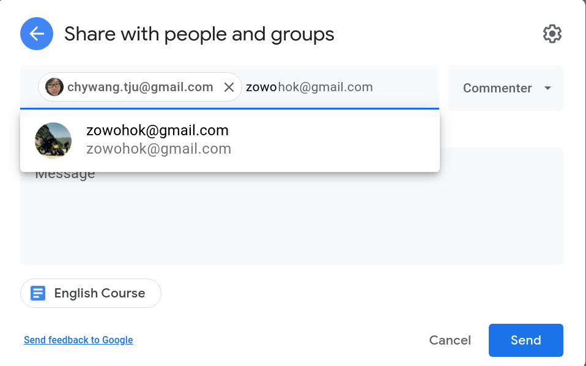

# Reading

- [How To Write A Killer Resume Objective](https://theinterviewguys.com/objective-for-resume/)
- [Programmer Resume Samples](https://www.kickresume.com/en/help-center/programmer-resume-samples/)

# Writing - Put all together
- Learn the CV structures of the samples from the reading materials
- Gather the information from former tasks to form up your CV in a Google Doc
- Share your CV with coaches by adding the [emails](../coaches.md), and make sure the permission is either **Commenter** or **Editor**. (refer to the screenshot below)

